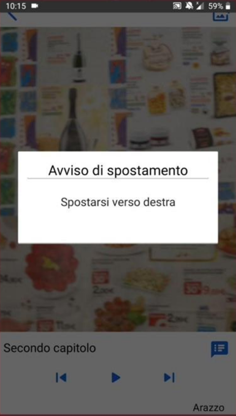
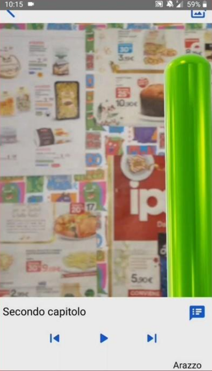

<!-- PROJECT SHIELDS -->
[](https://github.com/FedericaPaoli1/musa-arazzi-android/LICENSE)


<!-- PROJECT LOGO -->
<br />
<p align="center">
  <a href="https://github.com/FedericaPaoli1/musa-arazzi-android">
    
  </a>
 
  <h3 align="center">musa-arazzi-android</h3>

  <p align="center">
    AR recognition of very large artworks for Accessible Museums
    <br />
    <a href="https://drive.google.com/file/d/1dA2lSNrJ3ZgYb9iCgIR-CV-XcCJxkBzg/view?usp=sharing"><strong>View Demo »</strong></a>
  </p>
</p>


<!-- TABLE OF CONTENTS -->
<details open="open">
  <summary>Table of Contents</summary>
  <ol>
    <li>
      <a href="#about-the-project">About The Project</a>
      <ul>
        <li><a href="#built-with">Built With</a></li>
      </ul>
    </li>
    <li>
      <a href="#getting-started">Getting Started</a>
      <ul>
        <li><a href="#prerequisites">Prerequisites</a></li>
        <li><a href="#installation">Installation</a></li>
      </ul>
    </li>
    <li><a href="#usage">Usage</a></li>
    <li><a href="#license">License</a></li>
    <li><a href="#contact">Contact</a></li>
  </ol>
</details>


<!-- ABOUT THE PROJECT -->
## About The Project

MusA is a project developed for the Mobile Application Development (MobiDEV) exam at the University of Milan (academic year 2019-2020). 
It implements the AR recognition of very large artworks for Accessible Museums. 

### Built With

* [Android](https://developer.android.com/)
* [Java 8](https://docs.oracle.com/javase/8/)
* [ARCore](https://developers.google.com/ar/develop)
* [Android Studio](https://developer.android.com/studio)


<!-- GETTING STARTED -->
## Getting Started

Android phone/emulator is required.

### Prerequisites

* Google Play Services for AR

### Installation

1. Clone the repo
   ```sh
   git clone https://github.com/FedericaPaoli1/musa-arazzi-android.git
   ```
2. Open Android Studio
3. Run the application on android phone/emulator


<!-- USAGE EXAMPLES -->
## Usage
* Choose an artwork
<br />
<p align="center">
  
</p>
<br />
<br />
<br />

* User's guide to visiting the artwork starting from a close-up framing 
<br />
<p align="center">
  
</p>
<br />
<br />
<br />

* Guide to a recommended observation point on ground
<br />
<p align="center">
  
</p>
<br />
<br />
<br />

* Guide to the correct orientation of the smartphone
<br />
<p align="center">
  
</p>
<br />
<br />
<br />

* Reading the description of the different parts of the work
<br />
<p align="center">
  
</p>
<br />
<br />
<br />


* Highlighting what it's described
<br />
<p align="center">
  
</p>
<br />
<br />
<br />


<!-- LICENSE -->
## License

Distributed under the MIT License. See `LICENSE` for more information.


<!-- CONTACT -->
## Contact

Federica Paoli' - federica.p08@gmail.com

Project Link: [https://github.com/FedericaPaoli1/musa-arazzi-android](https://github.com/FedericaPaoli1/musa-arazzi-android)
